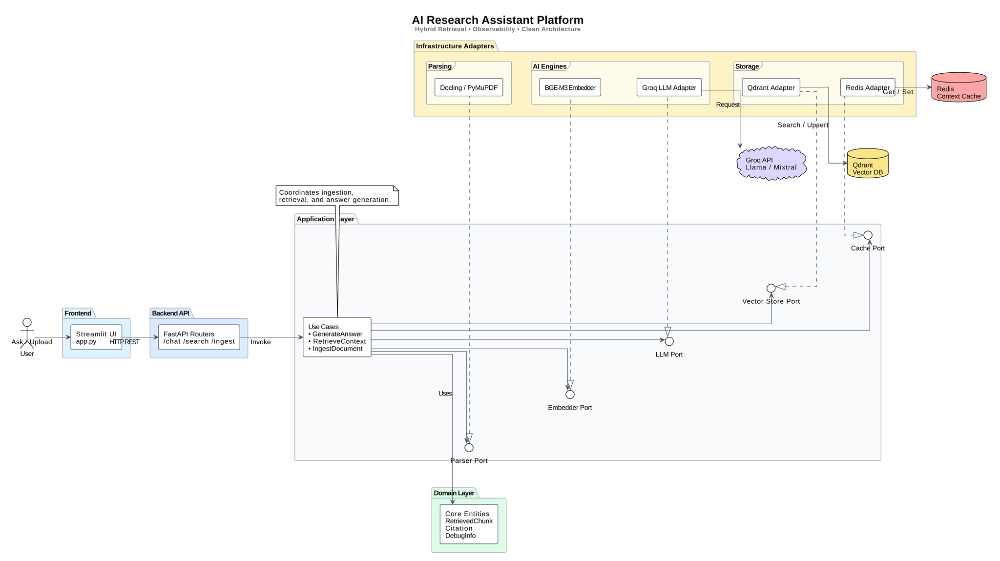
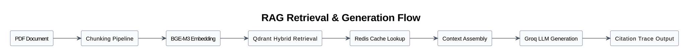

# Research Assistant plaforms


production-oriented Retrieval-Augmented Generation (RAG) system for academic and technical research.
Built with FastAPI, Qdrant, Redis, and BGE-M3 hybrid retrieval to support scalable document ingestion, grounded question answering, and retrieval observability.
## Quick demo

https://github.com/user-attachments/assets/141681c7-0ad6-487a-a2ce-e6c93a29f92f

## Why This Project?

Most open-source RAG (Retrieval-Augmented Generation) tutorials rely heavily on high-level orchestration frameworks (like LangChain or LlamaIndex), which often obscure the underlying mechanics and lead to inefficient, unscalable "toy" applications.

This project was built from the ground up with a **Production-First Mindset** to solve real-world engineering challenges in RAG systems:
- **Transparency & Trust:** Providing deep *Retrieval Observability* and strict citation tracking so users can verify exactly where the LLM's answers come from.
- **True Hybrid Search:** Moving beyond naive Python-side keyword filtering by leveraging native database-level dense and sparse vector fusion.
- **Resource Efficiency:** Implementing custom asynchronous pipelines and concurrency guards to parse and embed heavy documents reliably, even on constrained local hardware without running out of memory (OOM).

It serves as a robust, scalable boilerplate for anyone looking to build reliable, production-oriented AI research assistants.

## Key Features & Architecture Highlights

### 1. True Multi-Stage Hybrid Retrieval
Unlike basic RAGs that rely solely on Dense embeddings (Semantic) or perform "fake hybrid" by manually filtering keywords in Python, this system utilizes **Native Database-level Hybrid Search**:
* **BGE-M3 (FlagEmbedding):** Extracts both 1024-dimensional **Dense Vectors** (Semantic context) and **Sparse Vectors** (Lexical/BM25 exact match weights) simultaneously.
* **Qdrant Native RRF:** Both vectors are sent to Qdrant's C++ engine via the `Prefetch` Query API. Qdrant performs the multi-stage search and **Reciprocal Rank Fusion (RRF)** natively, eliminating Python-side bottlenecks and Out-Of-Memory (OOM) risks.

### 2. Distributed Cache Pattern
To optimize latency and memory, the system decouples vector search from payload retrieval:
* **Qdrant** acts strictly as the Vector Index (storing only dense/sparse arrays and lightweight `cache_id`s).
* **Redis** acts as the high-speed KV Store for storing heavy document payloads (Markdown chunks, metadata) with strict Time-To-Live (TTL) management.
* *Fallback Strategy:* If a cache miss occurs in Redis, the system seamlessly falls back to regenerating the context.

### 3. Asynchronous, Non-Blocking Ingestion Pipeline
Uploading large PDFs does not freeze the API or the UI:
* **FastAPI BackgroundTasks:** Document parsing (via `Docling`), chunking, embedding, and upserting are fully delegated to background workers.
* **Thread-Safe TaskTracker:** An in-memory singleton tracks real-time progress.
* **Streamlit Fragments (`@st.fragment`):** The frontend UI polls the backend status API without re-rendering the entire chat interface, providing a smooth user experience.

### 4. Advanced Observability & Citation Debugging
Built for transparency, ensuring the LLM is truly grounded:
* **Strict Citation:** The LLM (via Groq) is strictly prompted to cite its sources using `[1]`, `[2]` markers.
* **Retrieval Debug UI:** A dedicated side-panel in Streamlit exposes raw telemetry: 
  * Cache Hit/Miss status.
  * Micro-latencies breakdown: *Embedding Time*, *Vector Search Time*, *LLM Generation Time*.
* **Context Inspector:** Users can expand citations to inspect the exact Chunk ID, Document Name, Page Number, and Similarity Score used by the LLM.
### 5. Concurrent Ingestion Benchmark

The ingestion pipeline is benchmarked using concurrent PDF uploads through the HTTP API layer.

The benchmark simulates multiple users uploading documents simultaneously to evaluate:
- API responsiveness
- ingestion stability
- queue behavior
- resource saturation under constrained local hardware

#### Benchmark Setup

**Hardware**
- Intel i5-5200U
- 16GB RAM
- CPU-only environment

**Pipeline Constraints**
- Bounded ingestion workers: 2
- Disk-backed intermediate storage enabled

#### Test Scenarios

- Batch 5 concurrent uploads
- Batch 10 concurrent uploads

#### Metrics

- Success / failure count
- API response latency
- Average ingestion time
- P95 ingestion time
- Throughput
- Queue saturation behavior

#### Benchmark Results

| Batch Size | Success / Fail | Total Time | Avg API Latency | Avg Ingestion | P95 Ingestion | Throughput |
|------------|----------------|------------|-----------------|---------------|---------------|------------|
| 5 Users    | 5 / 0          | 1140.05s   | 0.15s           | 732.95s       | 1109.52s      | 0.26 files/min |
| 10 Users   | 10 / 0         | 2201.66s   | 0.11s           | 1245.29s      | 2128.30s      | 0.27 files/min |

#### Benchmark Analysis

The API layer remained responsive under concurrent uploads due to asynchronous request handling.

However, ingestion throughput degraded significantly as embedding generation saturated available CPU resources during concurrent PDF parsing and BGE-M3 embedding workloads.

Under bounded concurrency, increasing upload bursts primarily increased queue waiting time rather than API latency or overall throughput.

The benchmark demonstrates graceful degradation behavior:
- the API layer remained responsive
- ingestion tasks completed successfully
- throughput remained bounded by available worker capacity
- no ingestion failures or server crashes were observed

#### Performance Notes

These benchmarks were executed on CPU-only local hardware and are intended to analyze architectural behavior and bottlenecks rather than represent production-scale throughput.

Stress testing beyond 10 concurrent uploads was intentionally avoided due to thermal saturation and diminishing benchmarking value on constrained hardware.

#### Observed Bottlenecks

- **CPU Saturation:** Both `Docling` layout parsing and `BGE-M3` vector encoding are heavily CPU-bound. In a CPU-only environment, this creates a strict upper limit on ingestion throughput.
- **In-Memory Task Tracking:** The current `TaskTracker` resides in the FastAPI process memory, making it vulnerable to data loss if the server restarts during long ingestion queues.
- **ThreadPool Contention:** Running heavy CPU tasks in Starlette's default `BackgroundTasks` ThreadPool requires strict concurrency controls (like `Semaphore`) to prevent starvation of synchronous API endpoints.

---

## System Architecture





```text
src/
├── api/             # FastAPI Routers & Pydantic Models
├── application/     # Use Cases (GenerateAnswer, RetrieveContext, IngestDocument) & Ports
├── domain/          # Core Business Entities (RetrievedChunk, Citation, Debug)
├── infrastructure/  # Adapters (QdrantStore, BgeEmbedder, RedisCache, GroqChatModel)
└── utils/           # Structured Logging & Telemetry
```

## Tech Stack
- **Backend Framework:** FastAPI
- **Frontend UI:** Streamlit
- **Vector Database:** Qdrant (Docker)
- **Caching Layer:** Redis (Docker)
- **Embedding Model:** BAAI/bge-m3 (via `FlagEmbedding`)
- **LLM Provider:** Groq (Llama-3/Mixtral)
- **Document Parsing:** Docling / PyMuPDF

---

## Future Work

To evolve this system into a globally scalable enterprise architecture, the following improvements are planned:
- Celery / distributed ingestion workers
- Redis-backed persistent task tracking
- GPU embedding workers
- Distributed ingestion queues
- Retrieval evaluation datasets
- Prometheus / Grafana observability

---

## Getting Started
### Prerequisites
- Python 3.11+
- Docker & Docker Compose
- Groq API Key

### 1. Spin up the Infrastructure (Qdrant & Redis)
```bash
cd docker
docker-compose up -d
```

### 2. Install Dependencies
```bash
python -m venv .venv
source .venv/bin/activate  # macOS/Linux
# .venv\Scripts\activate   # Windows

pip install -r requirements.txt
```

### 3. Configure Environment Variables
```bash
cp .env.example .env
# Open .env and add your GROQ_API_KEY
```

### 4. Run the Application
You will need two terminal windows:

**Terminal 1: Start the Backend API**
```bash
uvicorn main:app --host 0.0.0.0 --port 8000
```

**Terminal 2: Start the Streamlit UI**
```bash
export API_BASE_URL=http://127.0.0.1:8000
streamlit run app.py
```

Open `http://localhost:8501` in your browser. Upload a research paper and start querying!

```bash
pytest
```
